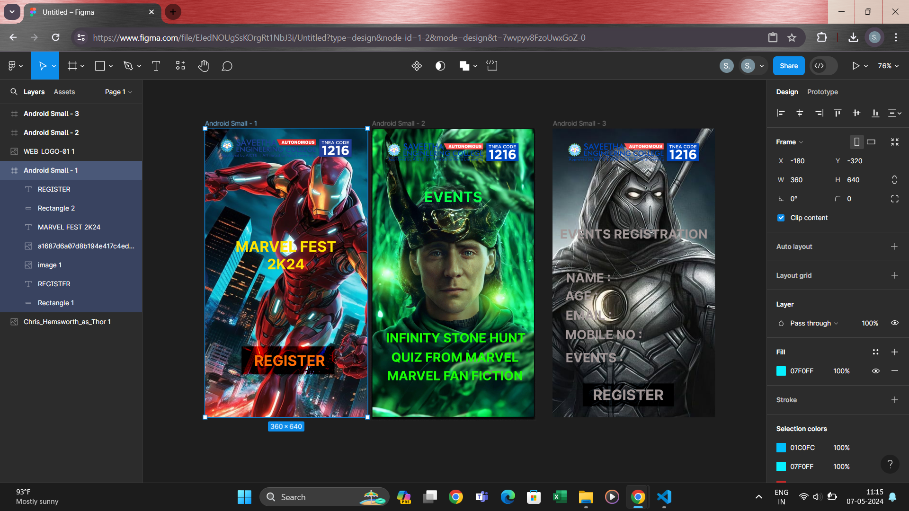

# Ex09 Event Registration Web Application
## Date: 07-05-2024

## AIM:
To design, develop and deploy a web application for event registration.

## DESIGN STEPS:

### Step 1:
Create a new frame.

### Step 2:
Select any one preset size of your choice.

### Step 3:
Select the shapes you need.

### Step 4:
Import images as needed.

### Step 5:
Create pages based on your need and link them.

### Step 6:

Validate the HTML and CSS code.

### Step 6:

Publish the website in the given URL.

## DESIGN TOOL:
Figma

## CODE:
## Page 1:
```
<div style="width: 360px; height: 640px; position: relative; background: #07F0FF">
  <div style="width: 190px; height: 48px; left: 76px; top: 372px; position: absolute; background: #01C0FC"></div>
  <div style="width: 190px; height: 48px; left: 76px; top: 406px; position: absolute; text-align: center; color: white; font-size: 32px; font-family: Inter; font-weight: 700; word-wrap: break-word">REGISTER<br/></div>
  
  
  <div style="width: 297px; height: 59px; left: 31px; top: 261px; position: absolute; text-align: center; color: #FFE500; font-size: 32px; font-family: Inter; font-weight: 700; word-wrap: break-word">MARVEL FEST 2K24</div>
  <div style="width: 206px; height: 62px; left: 81px; top: 483px; position: absolute; mix-blend-mode: color-burn; background: #C52727; box-shadow: 0px 4px 4px rgba(0, 0, 0, 0.25)"></div>
  <div style="width: 263px; height: 56px; left: 56px; top: 486px; position: absolute; text-align: center; color: #FF6E06; font-size: 32px; font-family: Inter; font-weight: 700; word-wrap: break-word">REGISTER</div>
</div>
```
## Page 2:
```
<div style="width: 360px; height: 640px; position: relative; background: white; box-shadow: 0px 4px 4px rgba(0, 0, 0, 0.25); border: 1px black solid">
  
  
  
  <div style="width: 242px; height: 66px; left: 59px; top: 118px; position: absolute; text-align: center; color: #05FF4B; font-size: 32px; font-family: Inter; font-weight: 700; word-wrap: break-word">EVENTS</div>
  <div style="width: 310px; height: 52px; left: 31px; top: 438px; position: absolute; text-align: center; color: #19FF05; font-size: 28px; font-family: Inter; font-weight: 700; word-wrap: break-word">INFINITY STONE HUNT</div>
  <div style="width: 310px; left: 29px; top: 531px; position: absolute; text-align: center; color: #19FF05; font-size: 28px; font-family: Inter; font-weight: 700; word-wrap: break-word">MARVEL FAN FICTION</div>
  <div style="width: 286px; left: 41px; top: 490px; position: absolute; text-align: center; color: #19FF05; font-size: 28px; font-family: Inter; font-weight: 700; word-wrap: break-word">QUIZ FROM MARVEL</div>
</div>
```
## Page 3:
```
<div style="width: 360px; height: 640px; position: relative; background: white">
  
  
  
  <div style="width: 360px; height: 53px; left: 0px; top: 207px; position: absolute; text-align: center; color: #A19797; font-size: 28px; font-family: Inter; font-weight: 700; word-wrap: break-word">EVENTS REGISTRATION</div>
  <div style="width: 302px; height: 51px; left: 28px; top: 431px; position: absolute; color: #A19797; font-size: 28px; font-family: Inter; font-weight: 700; word-wrap: break-word">MOBILE NO :</div>
  <div style="width: 302px; height: 51px; left: 29px; top: 388px; position: absolute; color: #A19797; font-size: 28px; font-family: Inter; font-weight: 700; word-wrap: break-word">EMAIL :</div>
  <div style="width: 302px; height: 51px; left: 28px; top: 345px; position: absolute; color: #A19797; font-size: 28px; font-family: Inter; font-weight: 700; word-wrap: break-word">AGE :</div>
  <div style="width: 302px; height: 51px; left: 30px; top: 305px; position: absolute; color: #A19797; font-size: 28px; font-family: Inter; font-weight: 700; word-wrap: break-word">NAME :</div>
  <div style="width: 302px; height: 51px; left: 29px; top: 482px; position: absolute; color: #A19797; font-size: 28px; font-family: Inter; font-weight: 700; word-wrap: break-word">EVENTS :</div>
  <div style="width: 202px; height: 51px; left: 67px; top: 565px; position: absolute; mix-blend-mode: color-burn; background: #D9D9D9"></div>
  <div style="width: 202px; height: 51px; left: 67px; top: 565px; position: absolute; text-align: center; color: #A19797; font-size: 32px; font-family: Inter; font-weight: 700; word-wrap: break-word">REGISTER</div>
</div>
```

## OUTPUT:


## RESULT:
The program to design, develop and deploy a web application for event registration is completed successfully.
